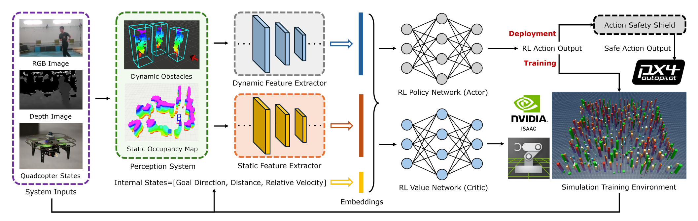

# NavRL

# 摘要

NavRL框架开发基于PPO算法，重构状态表示和动作表示，设计奖励函数，引入velocity obstacle避障策略：

- **识别挑战**：识别传统模块化导航方法在动态环境下的适应性差、模型简化导致次优等问题。
- **提出方法**：提出基于强化学习的导航框架 **NavRL**。
- **采用算法**：采用 **Proximal Policy Optimization (PPO)** 强化学习算法。
- **设计状态表示**：设计融合 **静态/动态障碍物** 和 **机器人状态** 的感知状态向量。
- **构造动作空间**：构造连续 **三维速度控制指令**，提升迁移性与可解释性。
- **集成安全机制**：引入基于 **Velocity Obstacle** 的 **动作安全盾机制**，用于运行阶段动作修正。
- **并行训练策略**：在 **NVIDIA Isaac Sim** 平台上实现 **千机并行训练**，加速策略收敛。
- **验证效果**：通过仿真与实物飞行实验验证，结果表明在动态环境中实现**最少碰撞次数**。

# 框架

输入： RGBD数据

感知模块：静态障碍物用体素图表示，动态障碍物用基于VO的box表示

特征提取模块：提取并拼接internal state，动态障碍物和静态障碍物的特征

基于强化学习的本体控制模块：使用多层感知机神经网络，构建actor-critic网络，构建PPO算法，输出速度指令

安全护盾：基于VO理论对RL输出的速度构建优化问题，使用速度限幅约束和速度护盾约束，进行避障

# 方法论

## 障碍物感知系统（Obstacle Perception System）

### 📌 感知系统总体设计

- 使用 **RGB-D图像与机器人状态**，分别感知 **静态** 和 **动态障碍物**。
- 采用不同表示方式处理两类障碍物，以适配其几何与运动特性。

---

### 🧱 静态障碍物表示

- 使用 **3D占用体素图（occupancy voxel map）** 离散化表示。
- 固定内存大小，由最大可容纳体素数决定。
- 每个体素占用数据保存在预分配数组中，支持常数时间查询 $\mathcal{O}(1)$。
- 每帧：
  - 基于最新深度图像，递归更新每个体素的占用概率；
  - 对动态障碍物检测到的包围框对应区域进行清除；
- **无需预建地图**，支持在线即时生成。

---

### 🚧 动态障碍物表示

- 使用 **带速度估计的3D包围盒（bounding box + velocity）** 表示。
- 为避免高噪声与计算开销，采用 **轻量级集成检测器（ensemble method）**，包括：
  - **U-depth 检测器**：
    - 将深度图转为“鸟瞰图”；
    - 用连通线分组提取障碍物边界；
  - **DBSCAN 检测器**：
    - 点云聚类，分析边界点获取中心和大小。
- 两者容易产生误报，采用**交叉验证机制**筛选一致结果。
- 借助 **YOLO 检测器** 对包围框重新投影至图像平面，进行静态/动态障碍物分类。

---

### 📈 动态障碍物速度估计

- 使用 **跟踪模块（tracking module）**，包括两个阶段：
  1. **数据关联**（data association）：
     - 构造特征向量：位置、包围盒大小、点云尺寸与标准差；
     - 通过相似度匹配实现帧间关联。
  2. **状态估计**（state estimation）：
     - 使用 **卡尔曼滤波器（Kalman filter）**；
     - 应用 **恒加速度模型** 建模速度变化。

## 强化学习建模（Reinforcement Learning Formulation）

### 🎯 强化学习任务建模

- 将导航任务建模为马尔可夫决策过程（MDP）：
  $$
  (S, A, P, R, \gamma)
  $$
  - **S**：状态空间（机器人内部状态 + 感知信息）  
  - **A**：动作空间（速度控制）  
  - **P**：状态转移函数  
  - **R**：奖励函数（目标驱动 + 碰撞惩罚）  
  - **$\gamma$**：未来奖励折扣因子，$\gamma \in [0, 1]$

- 强化学习目标：
  $$
  \pi^* = \arg \max_{\pi} \mathbb{E} \left[ \sum_{t=0}^{T} \gamma^t R(s_t, a_t) \right]
  $$

---

### 🧾 状态建模 State

状态由三部分组成：

#### 1. 🧠 机器人内部状态 $S_{\text{int}}$
$$
S_{\text{int}} = \left[
\frac{P_g^G - P_r^G}{\|P_g^G - P_r^G\|},\ 
\|P_g^G - P_r^G\|,\ 
V_r^G
\right]^T
$$
- $P_r$：机器人位置，$P_g$：目标位置，$V_r$：当前速度  
- 使用**目标坐标系（Goal Coordinate Frame）**建模

#### 2. 🚧 动态障碍物状态 $S_{\text{dyn}}$
$$
S_{\text{dyn}} = [D_1, ..., D_{N_d}]^T, \quad D_i \in \mathbb{R}^M
$$

每个障碍物状态向量：
$$
D_i = \left[
\frac{P_{oi}^G - P_r^G}{\|P_{oi}^G - P_r^G\|},\ 
\|P_{oi}^G - P_r^G\|,\ 
V_{oi}^G,\ 
\text{dim}(o_i)
\right]^T
$$

#### 3. 🧱 静态障碍物状态 $S_{\text{stat}}$
- 表示为射线投影距离矩阵：
$$
S_{\text{stat}} = [R_{\theta_0}, ..., R_{\theta_{N_v}}],\quad R_{\theta_i} \in \mathbb{R}^{N_h}
$$
- $N_v$：垂直方向角度数量，$N_h$：水平方向射线数量

---

### 🚦 动作建模 Action

- 输出速度向量 $V_{\text{ctrl}} \in \mathbb{R}^3$
- 使用 Beta 分布建模，输出归一化速度后变换为实际控制速度：
$$
V_{\text{ctrl}}^G = v_{\text{lim}} \cdot (2 \cdot \hat{V}_{\text{ctrl}}^G - 1),\quad \hat{V}_{\text{ctrl}}^G \in [0, 1]
$$
- 训练时从 Beta 分布采样，部署时使用其均值输出  
- **优于 Gaussian 分布的策略**：无偏、更快收敛

---

### 🧮 奖励函数 Reward

奖励函数由多项加权组合而成：
$$
r = \lambda_1 r_{\text{vel}} + \lambda_2 r_{\text{ss}} + \lambda_3 r_{\text{ds}} + \lambda_4 r_{\text{smooth}} + \lambda_5 r_{\text{height}}
$$

#### 1. 🏃‍♂️ 速度奖励 $r_{\text{vel}}$
$$
r_{\text{vel}} = \frac{P_g - P_r}{\|P_g - P_r\|} \cdot V_r
$$
> 鼓励机器人朝目标方向快速移动

#### 2. 🧱 静态避障奖励 $r_{\text{ss}}$
$$
r_{\text{ss}} = \frac{1}{N_h N_v} \sum_{i=1}^{N_h} \sum_{j=1}^{N_v} \log S_{\text{stat}}(i, j)
$$
> 鼓励远离静态障碍物

#### 3. 🛑 动态避障奖励 $r_{\text{ds}}$
$$
r_{\text{ds}} = \frac{1}{N_d} \sum_{i=1}^{N_d} \log \|P_r - P_{oi}\|
$$
> 鼓励避开动态障碍物

#### 4. 🎯 平滑性奖励 $r_{\text{smooth}}$
$$
r_{\text{smooth}} = -\|V_r(t_i) - V_r(t_{i-1})\|
$$
> 惩罚控制指令突变

#### 5. 🕊 高度奖励 $r_{\text{height}}$
$$
r_{\text{height}} = -\left( \min(|P_{r,z} - P_{s,z}|,\ |P_{r,z} - P_{g,z}|) \right)^2
$$
> 限制机器人飞行高度，避免通过升高规避障碍

## 网络结构与策略训练（Network Design and Policy Training）

### 🧱 状态预处理

- 状态包含多个组成部分（内部状态 + 障碍物特征）；
- 静态与动态障碍物表示为 **二维矩阵（2D）**；
- 使用 **卷积神经网络（CNN）** 提取特征；
- 提取后的特征转为 **一维嵌入向量（1D embedding）**；
- 与机器人内部状态拼接，形成最终的策略网络输入。

---

### 🧠 网络结构与训练算法

- 策略网络采用 **Proximal Policy Optimization（PPO）算法**；
- 包含：
  - Actor 网络（输出动作）；
  - Critic 网络（评估动作价值）；
- 两者均使用 **多层感知器（MLP）** 实现。

---

### 🚁 训练平台与并行策略

- 使用 **NVIDIA Isaac Sim** 作为训练仿真平台；
- 实现 **多无人机并行训练（成千上万架）**；
- 每个训练周期：
  - 随机生成机器人位置与目标；
  - 在碰撞或任务结束后重置；
- 训练环境为 **森林式布置**，包含静态与动态障碍物。

---

### 📈 提升策略表现：课程学习策略

- 引入 **课程学习（Curriculum Learning）** 提高学习效率：
  - 初始阶段障碍物密度较低；
  - 当导航成功率超过设定阈值，逐渐增加障碍物数量；
- 实验证明：
  - 该策略显著提升了 RL 策略在复杂环境中的导航成功率。

### 📊 PPO、MLP、Actor-Critic 对比表

| 项目             | 类型        | 说明与作用                                             |
| ---------------- | ----------- | ------------------------------------------------------ |
| PPO              | 算法        | Proximal Policy Optimization，约束策略更新，稳定易收敛 |
| MLP              | 网络结构    | 多层全连接感知机，构建策略网络和价值网络               |
| Actor-Critic     | 架构范式    | 同时包含 Actor（策略网络）与 Critic（价值网络）        |
| Actor            | 网络模块    | 接收状态，输出动作或动作分布 $\pi(a|s)$                |
| Critic           | 网络模块    | 接收状态，输出值函数 $V(s)$ 或 $Q(s,a)$，用于策略优化  |
| PPO 与 AC 的关系 | 算法 + 架构 | PPO 是基于 Actor-Critic 架构设计的优化算法             |
| MLP 的作用       | 实现手段    | 用于构建 Actor 和 Critic 的底层神经网络结构            |

### 🏋️ 强化学习训练流程（以 PPO 为例）

1. 初始化策略网络（Actor）和价值网络（Critic） ← 使用 MLP 结构

2. **与环境交互收集数据**（沿马尔可夫链）：
   
   - 输入状态 $s_t$
   - Actor 输出动作 $a_t$
   - 执行动作 $a_t$，环境返回：
     - 下一个状态 $s_{t+1}$
     - **奖励 $r_t$** ✅【奖励函数首次使用】
   - 存储 $(s_t, a_t, r_t, s_{t+1})$
   
3. **计算优势函数 Advantage**（用于优化目标）：
   - 使用 Critic 估计 $V(s_t)$ 和 $V(s_{t+1})$
   - 利用奖励计算：
     $$
     A_t = r_t + \gamma V(s_{t+1}) - V(s_t)
     $$
     ✅【奖励函数第二次使用，计算训练信号】

4. **优化 PPO 损失函数**：
   - Actor：最小化 Clipped Policy Loss（用 Advantage 引导）
   - Critic：最小化 TD误差 $(V(s_t) - R_t)^2$
     ✅【奖励函数第三次使用，监督 Critic 拟合】

5. 更新网络参数（梯度下降）

6. 重复第 2 步直到收敛

---
# 🧪 实验训练设置（Training Setup Summary）

### 📌 训练平台与设备

- **仿真平台**：NVIDIA Isaac Sim
- **训练硬件**：NVIDIA GeForce RTX 4090 GPU
- **训练时长**：约 10 小时
- **机器人最大速度**：2.0 m/s

---

### 🧮 策略网络结构

| 模块               | 类型                | 配置                                        |
| ------------------ | ------------------- | ------------------------------------------- |
| 特征提取器         | 卷积神经网络（CNN） | 3 层结构，静态输出维度 128，动态输出维度 64 |
| 策略网络（Actor）  | 多层感知机（MLP）   | 两层结构                                    |
| 价值网络（Critic） | 多层感知机（MLP）   | 两层结构                                    |

---

### 🔁 强化学习参数（基于 PPO）

| 参数                     | 值                                 |
| ------------------------ | ---------------------------------- |
| 算法                     | Proximal Policy Optimization (PPO) |
| PPO 裁剪比（clip ratio） | 0.1                                |
| 优化器                   | Adam                               |
| 学习率                   | $5 \times 10^{-4}$                 |
| 折扣因子 $\gamma$        | 0.99                               |

---

### 🧠 状态感知与估计配置

- **相机设备**：Intel RealSense D435i
- **状态估计方法**：LiDAR Inertial Odometry (LIO) 【47】
- **部署硬件（实物飞行）**：NVIDIA Jetson Orin NX

---

### 🧗‍♂️ 课程学习策略（Curriculum Learning）

- 初始障碍物配置：
  - 动态障碍物数量从 **60** 开始
- 动态调整方式：
  - 每当导航成功率 > 80% 时，动态障碍物数量增加 20 个
  - 逐步增长至 **最多 120 个障碍物**
- 最佳策略模型：
  - 在 **100 个动态障碍物环境下**达到 **80.96% 成功率**，被保存为最终模型

---

### 🧑‍🤝‍🧑 并行训练设置

| 项目             | 说明                                 |
| ---------------- | ------------------------------------ |
| 并行机器人数量   | 1024 台                              |
| 并行训练收集数据 | 从所有机器人同时采集轨迹信息         |
| 并行训练优势     | 加速收敛、提高训练回报、充分使用 GPU |
| 训练资源消耗     | 占满全部可用 GPU 显存                |

---

### ✅ 训练成功率指标说明

- **成功率定义**：
  > 从起点安全导航到目标点，不发生任何碰撞

- **训练终止条件**：
  > 成功率未继续上升，或达到最大障碍复杂度（如 120）

# 疑问：

1. 传统handcrafted类型的导航框架也会用到velocity obstacle，与这篇论文相比，两者是否算法原理相同，融入框架的方式相同？
2. 什么是课程学习 curriculum learning？ （从简单到复杂增加数据量的学习）