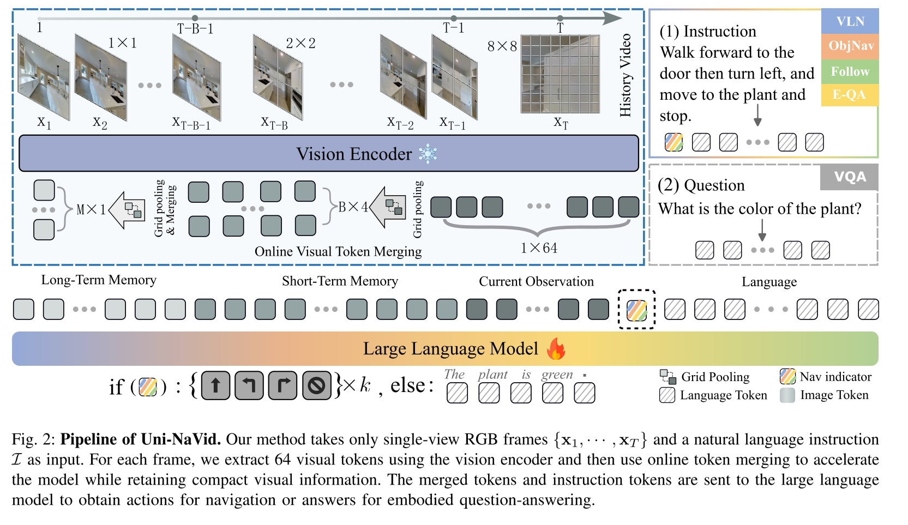

# Uni-Navid

# 摘要

- **Uni-NaVid** 是一种**统一的视觉-语言-动作（VLA）模型**，专为**多任务具身导航**设计，支持**指令导航、目标搜索、问答交互和人物跟随**等任务。
- 模型**输入为自然语言指令和单目 RGB 视频**，**输出低级控制动作**，实现**端到端导航策略学习**。
- 引入**在线视觉 Token 合并机制**，动态压缩冗余视觉信息，**推理速度提升至 5Hz**，满足实时部署需求。
- 构建了**360 万导航样本**的大规模多任务训练集，显著增强模型的**任务协同能力与泛化能力**。
- 在多个标准导航基准上实现**SOTA 性能**，并**成功部署于真实机器人平台**，展现出优越的**实用性与鲁棒性**。

# 相关工作

**多任务具身导航（Multi-Task Embodied Navigation）**
- 具身导航要求智能体根据人类指令在未知环境中自主移动。
- 主要聚焦四类任务：
  - 视觉-语言导航（VLN）
  - 目标物体导航（ObjNav）
  - 具身问答（EQA）
  - 人物跟随（Follow）
- 早期方法 [85, 93, 66, 97] 通过多任务学习取得初步成功，但在新环境（尤其是真实环境）中性能大幅下降。
- 近期方法 [114, 61, 35, 60, 121, 78] 利用大语言模型（LLMs）提升泛化能力，但依赖大量提示，影响时间效率。
- 本文方法采用**端到端训练**，提升了**多任务导航的鲁棒性和计算效率**。

**具身导航数据集（Embodied Navigation Datasets）**
- **视觉-语言导航**：
  - 主要数据集：R2R [4]、RxR [47]。
  - 本文使用连续环境版本 VLN-CE [44]，更适用于实际应用。
- **目标物体导航**：
  - 典型数据集：HM3D [69]、MP3D [11]、AiThor [124]。
  - 使用 HM3D 数据集 [76]，与 VLN-CE 同样的动作设置。
- **具身问答（EQA）**：
  - 数据集：MP3D-EQA [90]、MT-EQA [103]、Graph-EQA [83]、MX-EQA [38]。
  - 本文选用 MP3D-EQA，因其基线更新及时。
- **人物跟随（Human Following）**：
  - 现有基准缺乏文本描述，本文基于 Habitat 3.0 自建了语言描述的人物跟随基准 [68]。

**导航中的大语言模型应用（Large Language Models for Navigation）**

- **基于离散描述的导航**：
  - 方法 [120, 61, 60, 78] 将**视觉信息转为文本提示**，指导 LLM 推理；
  - 但抽象视觉为文本导致环境观测稀疏，且局限于静态场景。
- **基于视频输入的端到端导航**：
  - 方法 [111, 106] **使用视频直接训练 LLM 输出低级动作**，实现连续导航；
  - 但在长时任务中推理效率低下。

# 问题定义

- **导航任务定义**
  - 在时刻 \(T\)，输入包括：
    - 一段第一视角 RGB 视频帧序列：  
      $$
      \{x_1, x_2, ..., x_T\}
      $$
    - 一条自然语言指令：  
      $$
      \mathcal{I}
      $$
  - 智能体需规划未来 \(k\) 个动作：
      $$
      \{A_T, ..., A_{T+k-1}\}
      $$
  - 动作集合为：
      $$
      \{ \text{FORWARD}, \text{TURN-LEFT}, \text{TURN-RIGHT}, \text{STOP} \}
      $$
    - FORWARD（前进 25 cm）
    - TURN-LEFT（左转 30°）
    - TURN-RIGHT（右转 30°）
    - STOP（停止）

- **动作设定**
  - 动作是离散的、细粒度的，兼容连续环境中的避障、转向等操作。

---

# **整体框架概览**

## Uni-NaVid包含三个主要模块：

**视觉编码器（Vision Encoder）**

- 使用 **EVA-CLIP** 提取每帧的视觉特征，得到视觉 Tokens。

**在线视觉 Token 合并机制（Online Visual Token Merging）**

- 当前帧：Grid Pooling后保留**64**个Tokens（精细）。
- 近历史帧：更强的Grid Pooling，压缩至**4个Tokens**（中等精度）。
- 远历史帧：进一步Grid Pooling，最终每个远帧只剩下**1个Token**（高度压缩）。
- 以空间+时间的多层次压缩方式，保留关键视觉信息。

**大语言模型（Large Language Model, LLM）**

- 将视觉 Tokens 和语言 Tokens （指令经过 Tokenizer）拼接在一起。
- 在视觉和语言 Tokens之间**插入 Nav Indicator Token**，标识当前任务是导航还是问答。
- LLM最终输出：
  - 若是导航任务：输出未来四步动作序列；
  - 若是问答任务：输出自然语言答案。

---

# 方法论

## Observation Encoding（观测编码）

- 输入：
  - 第一视角视频序列：
    $$
    \mathcal{O}_T = \{x_1, \cdots, x_T\}
    $$
- 处理：
  - 每帧通过**视觉编码器**（**EVA-CLIP**）编码成视觉特征 tokens：
    $$
    X_t \in \mathbb{R}^{N_x \times C}
    $$
  - \(N_x\)：每帧划分的 Patch 数量（设为256）
  - \(C\)：每个 Token 的特征维度（如512）
- 表达式：
  $$
  X_{1:T} = \text{Encoder}(x_{1:T})
  $$
- 问题：
  - 随着时间推移，Token总数 \($T \times N_x$\) 逐步增加；
  - 导致推理延迟增长（1-2秒每步），影响真实导航部署。

---

## Online Visual Token Merging(在线视觉token合并)

- 目的：
  - 减少视觉Tokens数量，同时保留足够的导航信息。
- **核心思想**：
  - 最近观测帧更关键；
  - 相邻帧和邻近像素的视觉信息存在冗余。

### 1. 视觉Token分组（Visual Token Grouping）

- 将所有视觉 Tokens 分为三类：
  - 当前帧 Tokens：\($X_{\text{curr}}$\)
  - 短期记忆 Tokens：\($X_{\text{short}}$\)
  - 长期记忆 Tokens：\($X_{\text{long}}$\)

- 按照时间戳不同，应用不同的 Grid Pooling 操作：

  $$
  X_{1:T} =
  \begin{cases}
  X_{\text{curr}} = \text{GridPool}(X_T, \alpha_{\text{curr}}), & t = T \\
  X_{\text{short}} = \text{GridPool}(X_t, \alpha_{\text{short}}), & t \in [T-B, T) \\
  X_{\text{long}} = \text{GridPool}(X_t, \alpha_{\text{long}}), & t \in [1, T-B)
  \end{cases}
  $$

- 超参数设置：
  - \($\alpha_{\text{curr}} = 2$\)，\($\alpha_{\text{short}} = 8$\)，\($\alpha_{\text{long}} = 16$\)
  - \(B = 64\)（短期缓存长度）

- 各组特征形状：
  - \($X_{\text{curr}} \in \mathbb{R}^{64 \times C}$\)
  - \($X_{\text{short}} \in \mathbb{R}^{4 \times C}$\)
  - \($X_{\text{long}} \in \mathbb{R}^{1 \times C}$\)

---

### 2. 在线视觉Token更新（Online Visual Token Process）

- 新接收到帧 \(T+1\) 后，仅对局部更新，不重新处理全序列。
- 操作包括：

  - 当前帧压缩到短期记忆：

    $$
    X_{\text{curr} \rightarrow \text{short}} = \text{GridPool}(X_{\text{curr}}, \frac{\alpha_{\text{short}}}{\alpha_{\text{curr}}})
    $$

  - 最老短期记忆压缩到长期记忆：

    $$
    X_{\text{short} \rightarrow \text{long}} = \text{GridPool}(X_{\text{short}}, \frac{\alpha_{\text{long}}}{\alpha_{\text{short}}})
    $$

---

### 长期视觉Token合并（Long-Term Visual Token Merging）

- 为防止 \($X_{\text{long}}$\) 线性增长，引入基于**相似度的动态合并**。
- 若两帧**余弦相似度超过阈值** \($\tau$\)（设为 0.95）：

  $$
  \cos(X_{\text{long}}, X_{\text{short} \rightarrow \text{long}}) > \tau
  $$

- 则执行加权合并：

  $$
  X_{\text{long}} = \frac{1}{K+1} \left( K X_{\text{long}} + X_{\text{short} \rightarrow \text{long}} \right)
  $$

- 其中 \(K\) 表示当前长期Token合并了多少帧的信息。

- 否则直接添加新的长期Token。

## Action Planning (动作规划)

**目标**：

- 将合并后的视觉 Tokens 输入到大语言模型（LLM）中；
- 实现动作规划（预测未来四步动作）。

---

### 1. 跨模态视觉投影（Cross-Modality Visual Projection）

- 将合并后的视觉 Tokens：
  $$
  X_{\text{merged}} = \{X_{\text{long}}, X_{\text{short}}, X_{\text{curr}}\}
  $$
  输入到跨模态投影器 \($P_V(\cdot)$\) 中，得到视觉观察 Tokens：

  $$
  E_T^V = P_V(X_{\text{merged}})
  \tag{7}
  $$

- **跨模态投影器 \($P_V(\cdot)$\)**：
  
  - 使用**两层多层感知机（MLP）**实现；
  - 作用是将视觉特征映射到 LLM 输入所需的表征空间。

---

### 2. 语言指令编码（Instruction Encoding）

- 使用 LLM 自带的 Tokenizer 和 Embedding层（如 **Vicuna-7B [20]**）；
- 将自然语言指令编码成语言观察 Tokens：
  $$
  E_T^L
  $$

---

### 3. 输入序列拼接（Input Token Sequence）

- 完整的 LLM 输入序列结构：

- **导航任务指示器**：
- 插入特殊的 \<NAV> Token；
- 用于指示当前任务是导航动作预测；
- 参考了文献 [111, 67] 的方法。

---

### 4. 动作推理（Action Inference）

- 将完整输入序列送入 LLM；
- 推理出未来四步动作的动作 Tokens：

$$
\{E_T^A, E_{T+1}^A, E_{T+2}^A, E_{T+3}^A\}
$$

- **动作集合**：
$$
\{\text{FORWARD}, \text{TURN-LEFT}, \text{TURN-RIGHT}, \text{STOP}\}
$$

- 各动作含义：
- FORWARD：前进 25 cm；
- TURN-LEFT / TURN-RIGHT：旋转 30°；
- STOP：停止运动。

---

### 5. 多步预测的优势

- 预测未来四步动作可以取得最佳导航性能；
- 支持长时序动作规划（long-horizon planning）；
- 支持异步部署（asynchronous deployment），
- 实现非阻塞式（non-blocking）导航推理，适应真实环境需求。

---

