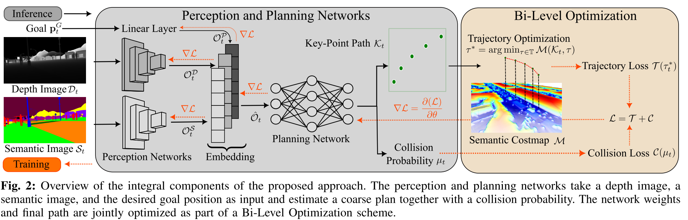

# ViPlanner

# 传统方法的局限性

基于假设：给定一个具有给定可遍历性估计的大部分可观测环境

- 模块化几何方法：基于点云或栅格地图，利用占用率或行走难度等指标确定通行性，使用采样或优化搜索可行路径。然而， 仅几何测量会导致无法对具有相似几何形状的不同地形进行推理，如无法预测可穿越楼梯的路径。
- 模块化语义方法：在几何法的基础上，添加带有语义标签的可通行成本。然而，模块结合会对系统引入延迟。
- 模仿学习或自我监督学习：几何高清地图，可遍历模块以自我监督的方式在演示中学习，泛化性差。
- 强化学习或命令式学习：通过域随机化和噪声测量达到zero-shot泛化能力。然而，采用低采样效率和稀疏奖励使得训练RL模型非常耗时。命令式学习范式使用 bi-level-optimizatin，提高收敛速度，但需要现实世界数据来弥合差距。

# 框架

- 输入：深度图+语义地图
- 感知和规划模块：提取感知特征，规划粗略的碰撞概率和局部路径
- 双层优化模块：轨迹优化函数+碰撞优化函数
- 输出：神经网络权重，最终路径

# 问题建模

## 代价构建

1. 基于语义地图划分可通行区域（非二进制类型，用于N可类别，使用可微分的代价值）：

   - 环境空间：$\mathcal{Q} \subset \mathbb{R}^3$
   - 不可通行区域：$\mathcal{Q}_{\text{obs}} \subset \mathcal{Q}$
   - 可通行区域：$\mathcal{Q}_{\text{trav}} = \mathcal{Q} \setminus \mathcal{Q}_{\text{obs}}$
   - 可通行区域划分：$\mathcal{Q}_{\text{trav}} = \bigcup_{i=1}^{N} \mathcal{Q}_i$
   - 

2. 为每个路径点分配代价值

   - 代价定义：$c_i \in [0, \infty),\ \forall i \in \{1, \ldots, N\}$

   - 代价函数的取值集合：$c(x, y) \in \{c_1, \ldots, c_N\}$

3. 计算每段路径的代价值积分

   $\mathcal{T}^{\mathcal{T}}_{\mathcal{P}} = \int_{\mathcal{P}} c(x, y) \, dp$

4. 计算所有路径的代价总和

   $\mathcal{T}^{\mathcal{G}}_{\mathcal{P}} = \int_{\mathcal{P}} dp$

## 目标构建：

1. 输入深度信息和语义图像信息观测：$D_t \in \mathbb{R}^{H_D \times W_D}$，$S_t \in \mathbb{R}^{H_S \times W_S}$
2. 估计当前点到目标点的轨迹：

   $\tau_t = \Phi(D_t, S_t, \mathbf{p}^G_t, \theta)$
3. 最小化通行代价和目标代价：

   $\mathcal{T}^{\mathcal{T}}_{\tau} + \mathcal{T}^{\mathcal{G}}_{\tau}$
4. 训练权重为$\theta$的神经网络估计器$\Phi$

# 方法论

## 语义编码

分为30个种类，绿色代价最小

## 感知和规划网络

- 训练：分别使用两个网络以不共享权重的方式处理深度图和语义图，网络结构均为ResNet-18
- 推理感知信息：
  - 给定原始RGB图像，生成语义图$S_t$
  - 将两种图像转到同一个相机坐标系下，估计出两组特征向量：深度图特征，语义图特征$\mathcal{O}^D \in \mathbb{R}^{C_I \times M}$，$\mathcal{O}^S \in \mathbb{R}^{C_I \times M}$
- 将目标信息通过线性层映射到高维，使用特征向量$\mathcal{O}^P_t \in \mathbb{R}^{C_G \times M}, \quad C_G \geq 3$表示
- 将目标特征和感知特征向量进行拼接，拼接后的向量$\hat{\mathcal{O}}_t \in \mathbb{R}^{(2C_I + C_G) \times M}$

## 规划网络

在**卷积层和多层感知机**的基础上增加路径规划头和碰撞概率估计头：

- 路径规划头：预测一个稀疏的关键点集合$K$
- 碰撞概率估计头：每条轨迹与障碍物之间的碰撞风险，碰撞概率$\delta_\mu \le 0.5$的才能在推理阶段被执行

## 语义代价图

语义代价图仅在训练阶段使用，在推理阶段，精简后的策略根据RGB图估算出相应的路径

### 创建流程：

1. **构建**：根据环境大小和分辨率，建立二维网格地图。
2. **标注**：根据环境三维模型（mesh）为每个网格单元赋予语义类别标签。
3. **映射**：利用预设的类别-代价值映射（见表 I）将类别转换为运动代价值。
4. **分配**：将代价值赋值到每个网格单元，形成初步的代价图。

### 可微平滑处理过程：

1. **滤波**：首次应用高斯滤波，去除分类误差但保留小障碍物。
2. **计算**：计算每个点到最近类别边界的有符号距离梯度。
3. **反转**：在最小代价区域反转梯度方向，引导路径趋向代价最低区域中心（如走廊中轴）。
4. **训练引导**：通过该梯度加速训练并推动路径靠近低代价区域。
5. **再滤波**：再次应用高斯滤波，平滑不同语义类别区域之间的边界。

## 训练损失（创新点）

ViPlanner 使用了基于 ImpL 框架的损失函数设计，包含轨迹损失和碰撞损失两部分，并在原有基础上引入了**高维几何-语义融合损失结构**。

---

### 总损失构成

损失函数由以下两项组成：

- **轨迹损失项**：$\mathcal{T}_t(\tau_t)$  
- **碰撞损失项**：$\mathcal{C}_t(\tau_t, \mu_t)$

碰撞损失的定义如下：

$$
\mathcal{C} =
\begin{cases}
\text{BCELoss}(\mu, 0.0), & \mathbf{p}^K_i \in Q_{tra},\ \forall \mathbf{p}^K_i \in \tau \\
\text{BCELoss}(\mu, 1.0), & \text{否则}
\end{cases}
$$

---

### 轨迹损失结构（关键创新）

轨迹损失由以下四项构成：

$$
\mathcal{T}(\tau) = \alpha \mathcal{T}^T + \beta \mathcal{T}^G + \gamma \mathcal{T}^{\mathcal{M}} + \delta \mathcal{T}^H
$$

- $\mathcal{T}^T$：**可通行性损失**（考虑机器人宽度）  
- $\mathcal{T}^G$：**目标距离损失**（引入 log 缩放，抑制远距离目标影响）  
- $\mathcal{T}^{\mathcal{M}}$：**路径平滑损失**，沿用 iPlanner 设计  
- $\mathcal{T}^H$：**高度损失**（抑制上下绕障行为）

---

### 关节技术与公式亮点

#### ✅ 可通行性损失（考虑机器人宽度）：

$$
\mathcal{T}^T(\tau) = \frac{1}{3n} \sum_{i=1}^{n} \left[
\tilde{m}(\mathbf{p}^K_i) +
\tilde{m}(\mathbf{p}^K_i + w^R \cdot \mathbf{n}^K_i) +
\tilde{m}(\mathbf{p}^K_i - w^R \cdot \mathbf{n}^K_i)
\right]
$$

- 利用语义代价图 $\mathcal{M}$ 的双线性插值 $\tilde{m}(\cdot)$  
- 在路径左右两侧采样，考虑机器人本体宽度 $w^R$

#### ✅ 目标距离损失（带对数缩放）：

$$
\mathcal{T}^G(\tau) = \log(\|\mathbf{p}^K_n - \mathbf{p}^G_i\|_2 + 1.0)
$$

- 终点越近，损失越小，鼓励精确到达目标

#### ✅ 高度约束损失（避免绕障动作）：

$$
\mathcal{T}^H(\tau_t) = \frac{1}{n} \sum_{i=1}^{n} \left| z^K_{p,i} - \tilde{h}(\mathbf{p}^K_i) - h^R \right|
$$

- 控制路径的高度变化，避免机器人上下绕开障碍物

# 实现细节（Implementation）

本节主要描述了 ViPlanner 的仿真平台搭建与训练数据生成方法。

---

## 模拟环境（Simulation Environments）

- 在 **NVIDIA Omniverse** 平台完成全部训练，具有真实物理引擎支持；
- 使用四足机器人 **ANYmal** 进行实验，结合 **Orbit** 框架中提供的预训练 RL 控制策略；
- 选择的环境：
  - 室内：**Matterport3D** 数据集中的真实场景；
  - 室外：**CARLA** 数据集中典型城市道路环境；
- 自研插件实现两个数据集的导入与加载：
  - 支持真实物理碰撞模拟；
  - 替代几何近似点质心方法；
- 所有代码、插件与处理工具均已开源，便于未来复现与拓展。

---

## 训练集生成（Training Set Creation）

为构建大规模语义导航训练集，提出了**自动化多视角采样方案**：

#### ✅ 自动采样策略：
1. 基于 **Halton 序列**，在机器人可达区域内自动生成采样点；
2. 在每个点位渲染多角度视图，**最大化可通行区域的图像覆盖**；

#### ✅ 目标点生成与可达性筛选：
3. 从采样相机中心随机选取目标点；
4. 构建图结构，删除所有穿越高代价区域（costmap $\mathcal{M}$）的连接；
5. 保证目标点优先落入机器人视野范围（Field of View, FoV）内；
6. 数据生成流程支持**控制目标点的相对可视位置比例**。

#### ✅ 生成数据规模：
- 共采样约 **80k 对起点-目标点**路径样本；
- 涵盖环境：
  - 11 个 Matterport 场景（约 $36 \times 33$ 米）；
  - 1 个 CARLA 场景（$400 \times 400$ 米）；
  - 3 个仓库场景（约 $25 \times 35$ 米）。

---

### 🔍 技术亮点小结

- 使用 Omniverse 模拟真实接触与多种语义环境；
- 提出 **Halton 采样 + 视角控制 + 图论筛选** 的大规模训练集自动构建机制；
- 高度自动化、真实物理、支持语义标签，适配端到端网络训练。

# 实验（Experiments）

本部分包括模型训练流程、实验平台配置以及模拟与实物任务的设置细节。本文重点验证了 ViPlanner 的泛化能力与 sim-to-real 零样本迁移能力。

---

### ✅ 模型训练流程（Model Training）

- 优化器：使用 **SGD（随机梯度下降）**
- 学习率策略：**动态调度器（scheduler）**
- 提前终止机制：**early stopping**
- 硬件平台：**NVIDIA RTX 3090**
- 训练时长：约 **6 小时**
- 语义代价值设置范围：**0 ~ 2**（参见 Tab. I）

---

### ✅ 实验设置流程（Experiment Setup）

- 仿真部署：
  - 平台：**NVIDIA Jetson Orin AGX**
  - 模型输入：
    - 实时深度图像
    - 来自 **Mask2Former** 分割器生成的语义图（频率约 3Hz）
  - 语义模型微调数据：
    - 来源：瑞士苏黎世采集的小规模图像集
  - 推理频率：**规划器 10Hz**，异步复用语义图

---

### 🧪 模拟实验任务（Simulation Tasks）

在以下三种环境中验证导航效果：

1. **CARLA 城市环境**
   - 场景特点：十字路口、斑马线、车道
   - 目标：穿越可通行区域（如斑马线），避开车道等高代价语义区域

2. **NVIDIA 仓库环境**
   - 场景特点：货架、工作区、障碍密集
   - 目标：避开语义标记为“未知”的区域（如黄色工作区），规划可通行路径

3. **Matterport3D 室内环境**
   - 场景特点：真实家居布局、空间复杂
   - 目标：在语义多样、结构复杂的环境中进行本地路径规划

---

### 🧪 实物实验任务（Real-World Tasks）

部署在实际 ANYmal 四足机器人上，验证零样本迁移能力：

1. **户外城市街道实验**
   - 环境：城市街道 + 人行道 + 斑马线
   - 目标：正确穿越斑马线，识别低代价区域，沿人行道行进

2. **楼梯障碍实验**
   - 环境：含楼梯、平台等可几何通过但具有挑战的结构
   - 目标：识别并安全导航楼梯区域，避免几何方法出现的预测失败

---

📌 注：仿真与实物任务均支持零样本（zero-shot）从训练场景迁移，充分展示了方法的泛化能力与实用性。

